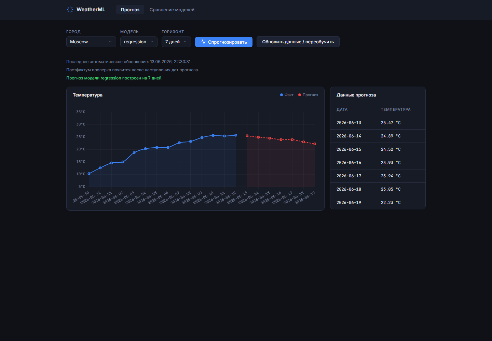

# WeatherML

Учебный веб-сервис прогноза средней дневной температуры. Пользователь
выбирает город, модель и горизонт от 1 до 7 дней, после чего получает
прогноз и может сравнить его с фактической погодой.

## Возможности

- загрузка исторической погоды;
- локальное хранение очищенных CSV-датасетов;
- модели Random Forest, ARIMA и LSTM;
- сохранение моделей, прогнозов и метрик;
- обновление данных и переобучение через интерфейс;
- постфактум расчёт MAE и RMSE;
- график фактической температуры и прогноза.

## Скриншот



## Источник данных

Данные загружаются из бесплатного
[Open-Meteo Historical Weather API](https://open-meteo.com/en/docs/historical-weather-api).
API-ключ не требуется.

Используются средняя, минимальная и максимальная температура, осадки и
максимальная скорость ветра по дням.

## Запуск

Требуются Docker Desktop и Docker Compose.

```powershell
docker compose up --build
```

Команду нужно выполнять из корневой папки проекта.

После запуска доступны:

- веб-интерфейс: http://localhost:8080
- Swagger UI: http://localhost:8020/docs
- проверка API: http://localhost:8020/health

Основные endpoints:

- `POST /models/train` — обучить выбранную модель;
- `POST /models/update-and-train` — обновить данные и переобучить модель;
- `GET /models/forecast` — получить прогноз на 1–7 дней;
- `GET /models/metrics` — получить метрики моделей;
- `GET /models/comparison` — сравнить сохранённый прогноз с фактом.
- `GET /automation/status` — получить статус фонового обновления.

Остановка:

```powershell
docker compose down
```

Запуск автоматических тестов:

```powershell
docker compose exec backend python -m unittest discover -s tests -v
```

## Первый прогноз

1. Выберите город и модель.
2. Нажмите «Обновить данные / переобучить».
3. После завершения обучения нажмите «Спрогнозировать».

При первом обновлении загружается история примерно за три года. Следующие
обновления добавляют только отсутствующие даты.

## Автоматическое обновление

В Docker Compose фоновая задача включена по умолчанию. Она обновляет уже
существующие датасеты и пересчитывает постфактум метрики при запуске backend,
а затем раз в сутки.

Настройки находятся в `docker-compose.yml`:

```yaml
AUTOMATION_ENABLED: "true"
AUTOMATION_INTERVAL_SECONDS: "86400"
AUTOMATION_RETRAIN_ENABLED: "false"
```

Автоматическое переобучение выключено по умолчанию, чтобы ежедневный запуск
LSTM не занимал ресурсы без необходимости.

## Структура

```text
backend/api/       API-эндпоинты
backend/ml/        модели и построение признаков
backend/services/  данные, прогнозы и метрики
frontend/          HTML, CSS, JavaScript и Nginx
data/              датасеты, прогнозы и метрики
models/            сохранённые модели
```

## Постфактум проверка

Каждый прогноз сохраняется вместе со временем создания. После наступления
прогнозируемой даты нужно снова обновить данные. Сервис сопоставит прогноз
с фактом по дате и рассчитает фактические MAE и RMSE.
